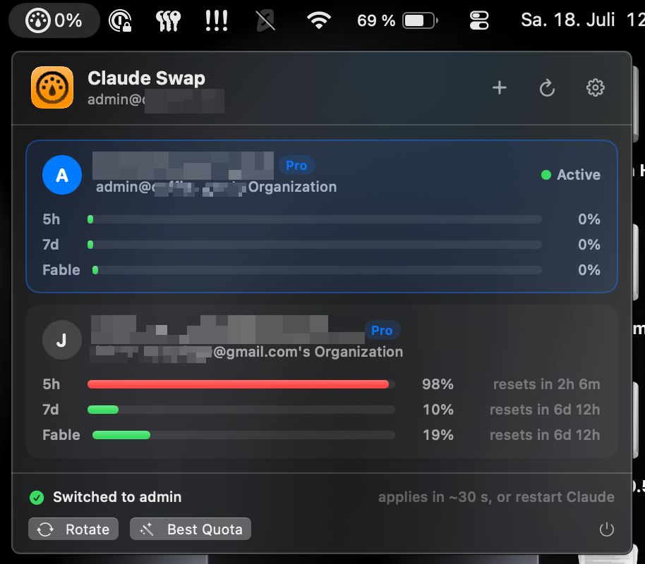

<div align="center">

# Claude Swap Bar

**Native macOS menu bar app and CLI for running several Claude Code accounts side by side.**

[](https://github.com/jx-grxf/claude-swap-bar/actions/workflows/ci.yml)
[](https://github.com/jx-grxf/claude-swap-bar/releases/latest)


[](https://sparkle-project.org/)
[](LICENSE)

*Every account stays logged in. Live usage meters. One command per account.*

</div>

<p align="center">
  
</p>

<p align="center"><em>Switch accounts and compare live quota windows without leaving the menu bar.</em></p>

---

## What it does

Claude Swap Bar gives every Claude Code account its own configuration folder, the way Anthropic documents it for [multiple accounts](https://code.claude.com/docs/en/authentication#log-in-with-multiple-accounts). Each account logs in once and stays logged in. Switching means starting Claude Code in a different folder, so no login is ever copied, refreshed or written back.

- **Accounts side by side.** Run your work and private account in two terminals at the same time.
- **Shared setup.** Every account shares settings, skills, plugins, hooks, agents, memory and transcripts with your normal `~/.claude`. User MCP servers and project trust are copied over on every start.
- **Default account.** Plain `claude` starts whichever account you pick in the menu bar or with `cseat use`.
- **`/swap` in a running session.** Ends the session and continues the same conversation with the other account, in the same terminal tab. Works even when the current account is out of quota, and Remote Control reconnects if `remoteControlAtStartup` is on.
- **Live usage meters.** 5-hour, 7-day and per-model windows per account, with reset countdowns.
- **Best Quota.** Make the account with the most 5h headroom the default in one click.
- **Remote Control and claude.ai connectors keep working**, because each account uses a normal claude.ai login, not a setup token.

### Why not swap one login?

Version 1 and tools like `cswap` swapped the single `Claude Code-credentials` Keychain item and kept their own copies of each login. Claude Code's refresh tokens are single-use. Once a running session refreshed one, the stored copy was dead, and switching back logged you out (`invalid_grant`). Version 2 never touches a credential. It only reads the current access token to show usage. An account whose token has expired shows as idle until Claude Code uses it again.

## Install

Grab the signed app from the [latest release](https://github.com/jx-grxf/claude-swap-bar/releases/latest), unzip, and drop it into `/Applications`.

Or build from source (macOS 14+, Xcode command line tools):

```sh
git clone https://github.com/jx-grxf/claude-swap-bar.git
cd claude-swap-bar
./build-app.sh
cp -R ClaudeSwapBar.app /Applications/
open /Applications/ClaudeSwapBar.app
```

Click **Install** in the menu bar popover once. That links the `cseat` command to `~/.local/bin/cseat` and adds one line to `~/.zshrc`, so plain `claude` follows the default account. Without the app: `/Applications/ClaudeSwapBar.app/Contents/MacOS/cseat setup`.

## Adding accounts

Your normal `~/.claude` login is the `main` account. To add another:

```sh
cseat add work --email you@company.com
```

This creates `~/.claude-seats/work` and opens the browser login. The browser authorizes whichever claude.ai account it is signed in to, so switch accounts there first or use a private window. `cseat` warns when the login doesn't match `--email`.

The menu bar **＋** button does the same in a terminal window.

## Command line

```text
cseat                          List accounts, usage and the default
cseat <name> [claude args…]    Start Claude Code with that account
cseat use <name>               Make <name> the default for plain `claude`
cseat best                     Make the account with the most 5h headroom the default
cseat move [name]              Inside a session (/swap): continue it with another account
cseat add <name> [--email e]   Create an account and log it in
cseat login <name> [--email e] Log an account in again
cseat remove <name> [--yes]    Delete an account and its login
cseat sync                     Re-link shared settings, skills and memory
cseat setup                    Install the shell integration for `claude`
cseat doctor                   Check every account
```

`cseat main` always starts your normal `~/.claude` account. A shell that already has `CLAUDE_CONFIG_DIR` set keeps it.

### Moving a running session

Type `/swap` (or `/swap work`) in a running session. Without a name it picks the default account, or the logged-in one with the most 5h headroom. `/swap` runs `cseat move` while the command expands, before anything reaches the model, so it also works on an account that hit its limit. `cseat move` ends the session's Claude Code process and leaves a note for the `claude()` shell function, which resumes the same conversation (`--resume <id>`) in the new account. Sessions started without the shell integration continue in a new terminal window instead.

Don't use `/login` inside a session to change accounts: it replaces the login of the account that session belongs to.

## How it works

| | Shared with `~/.claude` (symlink) | Own per account |
|---|---|---|
| Files | `settings.json`, `keybindings.json`, `statusline.sh`, top-level `*.md` | `.claude.json`, `history.jsonl` |
| Folders | `projects`, `skills`, `plugins`, `hooks`, `agents`, `commands`, `plans`, `tasks`, `todos`, `themes`, `file-history`, `output-styles` | `sessions`, caches, logs |
| Login | — | Keychain item `Claude Code-credentials-<hash>` |

On every start through `cseat` or the shell integration, new shared items are linked and the main `.claude.json` keys `mcpServers` plus per-project trust, allowed tools and MCP servers are merged into the account's `.claude.json` under Claude Code's advisory lock. A shared item an account already has as a real file or folder is left alone and reported by `cseat sync`.

Claude Desktop and claude.ai in the browser aren't affected. Use separate browser profiles for those.

## Usage meters and the rate limit

The usage endpoint allows roughly 30 requests per hour per account. The app and `cseat` share one cache, poll gently (default every 5 minutes, 3-minute cache), back off on 429 and honor `Retry-After`.

## Project layout

```
Sources/
├── SeatKit/                      # Shared core, never writes credentials
│   ├── Seat.swift                # Account folder, Keychain item name
│   ├── SeatStore.swift           # Create/remove/list, symlinks, config merge, default
│   ├── SeatCredentialReader.swift# Read-only login access, advisory lock
│   ├── SeatUsage.swift           # Usage fetch + shared cache
│   ├── UsageService.swift        # Usage endpoint client
│   └── ClaudeLauncher.swift      # Starts `claude` in an account
├── cseat/                        # Command-line tool
└── ClaudeSwapBar/
    ├── ClaudeSwapBarApp.swift    # MenuBarExtra entry point
    ├── Services/                 # AppState, terminal launcher, updates
    ├── Settings/                 # Settings window
    └── Views/                    # Menu popover, account rows, add-account flow
```
