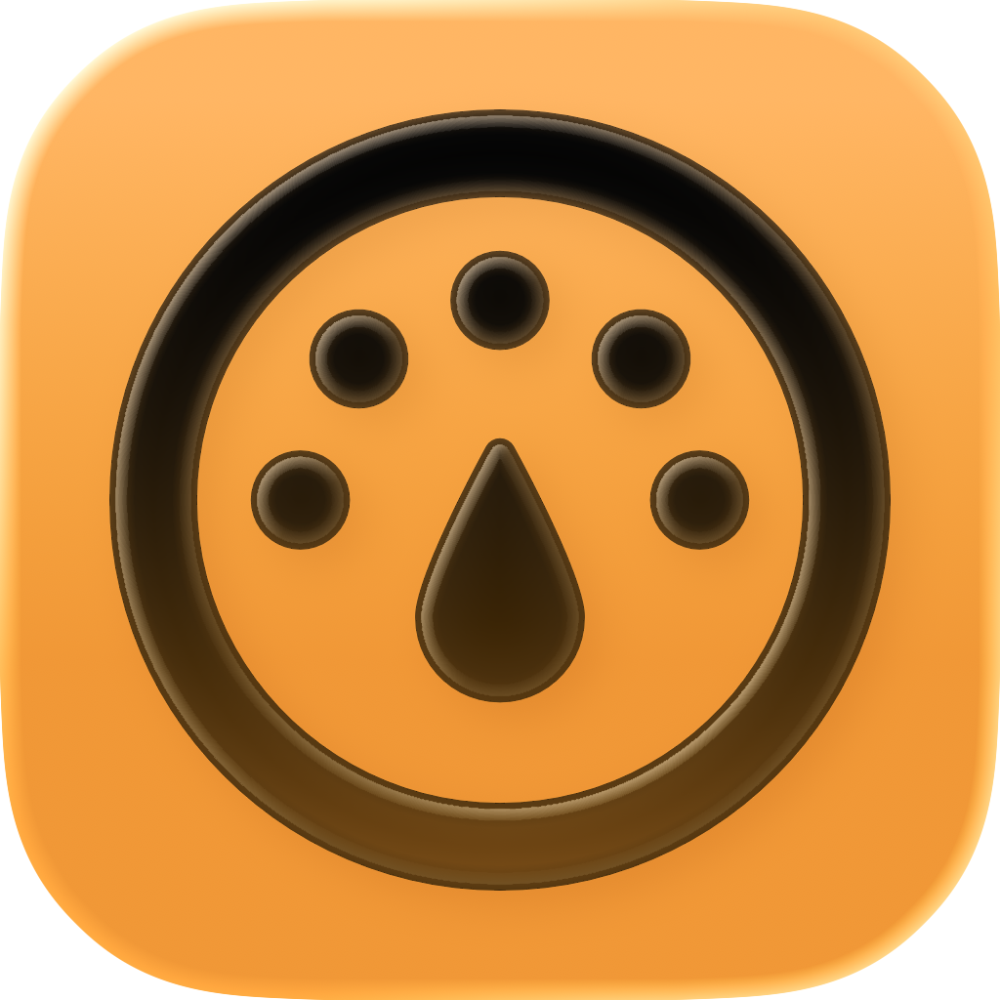

<div align="center">



# CSwap

**Run several Claude Code accounts side by side on your Mac — a menu bar app and the `cswap` command.**

[](https://github.com/jx-grxf/cswap/releases/latest)


[](LICENSE)

*Every account stays logged in. Live usage meters. `/swap` when one runs out.*

</div>

<p align="center">
  
  &nbsp;
  
</p>

---

## Why

Hit the 5-hour limit on one account and want to keep going on another? Logging out and back in with `/login` is slow, and tools that swap one shared login around eventually log you out for good: Claude Code's refresh tokens are single-use, so a copied login goes stale the moment a running session refreshes it.

CSwap gives every account its own configuration folder instead, the way Anthropic [documents it for multiple accounts](https://code.claude.com/docs/en/authentication#log-in-with-multiple-accounts). Each account logs in once and stays logged in. Switching means starting Claude Code in a different folder. No login is ever copied, refreshed or written back.

## Features

- **Accounts side by side.** Work and private account in two terminals at the same time.
- **`/swap` inside a session.** Ends the session and continues the same conversation with another account, in the same terminal tab, about two seconds later. Works even when the current account is out of quota.
- **Menu bar app.** Live 5-hour, weekly and per-model usage for every account, running sessions with a **Move to …** button, and one click to change which account new sessions use.
- **Automatic fallback.** When the default account hits a limit, new sessions start with the account that has the most quota left. Can be turned off.
- **Shared setup.** Settings, skills, plugins, hooks, agents, memory and transcripts are shared with your normal `~/.claude`. User MCP servers and project trust follow every account.
- **Remote Control and claude.ai connectors keep working**, because each account uses a normal login, not a setup token.
- **zsh and bash**, Ghostty and Terminal.app. The app and `cswap` stay in sync: whatever you change in one shows up in the other within a second.

## Install

1. Download `CSwap-<version>.zip` from the [latest release](https://github.com/jx-grxf/cswap/releases/latest), unzip it and move **CSwap.app** to `/Applications`. The app is signed and notarized.
2. Open it. A gauge icon appears in the menu bar.
3. Run the one-time setup in a terminal:

   ```sh
   /Applications/CSwap.app/Contents/MacOS/cswap setup
   ```

   It links `cswap` to `~/.local/bin`, adds one line to `~/.zshrc` (or `~/.bashrc` / `~/.bash_profile`), installs the `/swap` command and walks you through logging in your accounts. Clicking **Set Up** in the menu bar does the same without the questions.

Requires macOS 14 or later and [Claude Code](https://code.claude.com) installed.

### Build from source

```sh
git clone https://github.com/jx-grxf/cswap.git
cd cswap
./build-app.sh                      # ad-hoc signed; set SIGN_IDENTITY for Developer ID
cp -R CSwap.app /Applications/
/Applications/CSwap.app/Contents/MacOS/cswap setup
```

## Usage

Your normal `~/.claude` login is the `main` account. Add more:

```sh
cswap add work --email you@company.com
```

This creates the account and opens Claude Code's login screen. The browser authorizes whichever account it is signed in to, so switch accounts there first or paste the link into a private window. `cswap` warns when the login doesn't match `--email`.

| Command | What it does |
|---|---|
| `cswap` | Show every account with its usage |
| `cswap work` | Start Claude Code with the `work` account (any arguments pass through) |
| `claude` | Start the default account |
| `cswap use work` | Make `work` the default for new sessions |
| `cswap best` | Make the account with the most quota left the default |
| `/swap [account]` | Inside a session: continue it with another account |
| `cswap sessions` | List running sessions per account |
| `cswap move work --pid <pid>` | Move a running session from outside it |
| `cswap login work` | Log an account in again |
| `cswap remove work` | Delete an account and its login (shared data stays) |
| `cswap doctor` | Check the setup and every account |

> [!IMPORTANT]
> Don't use `/login` inside a session to change accounts. It replaces the login of the account that session belongs to. Use `/swap`.

## How it works

| | Shared with `~/.claude` (symlink) | Own per account |
|---|---|---|
| Files | `settings.json`, `keybindings.json`, `statusline.sh`, top-level `*.md` | `.claude.json`, `history.jsonl` |
| Folders | `projects`, `skills`, `plugins`, `hooks`, `agents`, `commands`, `plans`, `tasks`, `todos`, `themes`, `file-history`, `output-styles` | `sessions`, caches, logs |
| Login | — | Keychain item `Claude Code-credentials-<hash>` |

Accounts other than `main` live in `~/.cswap/<name>` and start with `CLAUDE_CONFIG_DIR` pointing there. On every start, new shared items are linked and the main `.claude.json` keys `mcpServers` plus per-project trust, allowed tools and MCP servers are merged in, under Claude Code's own advisory lock.

**`/swap` and Move.** The shell integration wraps `claude` and `cswap <account>` in a small loop. `/swap` runs `cswap move` while the command expands, before anything reaches the model. It leaves a note for that loop and ends the session's process. The loop then resumes the same conversation (`--resume <id>`) in the other account. Transcripts are shared, so nothing is lost. Sessions started without the shell integration continue in a new terminal window in the same project folder.

**Usage meters.** CSwap reads each account's current access token, read-only, and asks the usage endpoint. That endpoint allows roughly 30 requests per hour per account, so the app and `cswap` share one cache, poll every 5 minutes by default and back off on rate limits. An account whose token has expired shows as idle until Claude Code uses it again. Refreshing the token from outside would spend Claude Code's single-use refresh token.

Claude Desktop and claude.ai in the browser aren't affected. Use separate browser profiles for those.

## Uninstall

```sh
cswap remove <name>          # for each extra account, removes its login
rm ~/.local/bin/cswap
rm -rf ~/.cswap
```

Then delete the two `cswap` lines from your shell startup file, `~/.claude/commands/swap.md` and `/Applications/CSwap.app`. Your `~/.claude` stays as it was.

## Contributing

Issues and pull requests are welcome. See [CONTRIBUTING.md](CONTRIBUTING.md) for the build, test and release workflow.

## License

[MIT](LICENSE) © Johannes Grof

CSwap is an independent project, not affiliated with or endorsed by Anthropic. Claude and Claude Code are trademarks of Anthropic, PBC.
